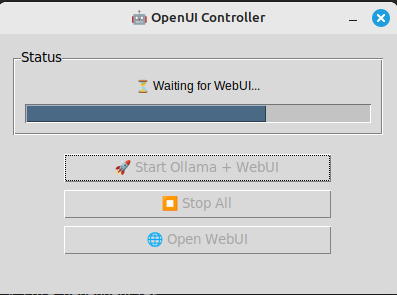

# Ollama OpenWebUI Launcher 🤖

[](https://opensource.org/licenses/MIT)

## What is this?

A **simple desktop launcher and system tray application** for **Ollama** and **Open-WebUI** services on Linux. Streamline your local AI workflow with one-click service management, real-time status monitoring, and seamless desktop integration. Instead of manually starting services in terminal, get a convenient desktop application with system tray support.

## Features

- **System Tray Integration** - Run in background with system tray icon
- **One-Click Launch** - Start both Ollama and Open-WebUI services with progress tracking
- **Service Management** - Start, stop, and monitor service status
- **Auto Browser Launch** - Automatically opens Open-WebUI in your browser when ready
- **Clean UI** - Simple, intuitive graphical interface
- **Lightweight** - Minimal resource usage

## Usage

### Desktop Mode (Window)
1. Run `python3 launcher.py`
2. Use buttons to start/stop services
3. Click "Open WebUI" to access the web interface



### System Tray Mode
1. If system tray is available, the app minimizes to tray
2. Right-click tray icon for quick actions:
   - **Show/Hide Window** - Toggle main window
   - **Start Services** - Launch Ollama + Open-WebUI
   - **Stop Services** - Stop all services
   - **Open WebUI** - Open browser to localhost:8080
   - **Quit** - Exit application


### Add at startup

Open the startup application manager in your computer, and add the following commande : `python3 /your_path/ollama-openwebui-launcher/launcher.py`.

## Requirements

- **Linux** with system tray support (GNOME, KDE, XFCE, etc.)
- **Python 3**
- **Ollama** installed and in PATH
- **Open-WebUI** installed and in PATH
- **GTK 3** and **AyatanaAppIndicator3** (for system tray)

## Install Dependencies

### 1. Linux Dependencies

**Ubuntu/Debian:**
```bash
sudo apt install python3-gi python3-gi-cairo gir1.2-gtk-3.0 gir1.2-ayatanaappindicator3-0.1
```

**Fedora:**
```bash
sudo dnf install python3-gobject gtk3-devel libayatana-appindicator3-devel
```

**Arch Linux:**
```bash
sudo pacman -S python-gobject gtk3 libayatana-appindicator
```

### 2. Install Ollama & Open-WebUI

If not already installed:
```bash
# Install Ollama
curl -fsSL https://ollama.ai/install.sh | sh

# Install Open-WebUI
pipx install open-webui
```

## Download & Run

```bash
git clone https://github.com/erwanastro/ollama-openwebui-launcher.git
cd ollama-openwebui-launcher
python3 launcher.py
```

## Troubleshooting

### No System Tray Icon
- Ensure your desktop environment supports system tray
- Install required GTK and AppIndicator packages
- Try running in window mode only

### Services Won't Start
- Verify Ollama is installed: `ollama --version`
- Verify Open-WebUI is installed: `open-webui --version`
- Check if ports 11434 (Ollama) and 8080 (Open-WebUI) are free

### Permission Issues
- Ensure user has permission to run ollama and open-webui commands
- Try running manually first to test

## Contributing

Contributions welcome! Please feel free to:
- Report bugs
- Suggest features
- Submit pull requests
- Improve documentation

## License

MIT License - feel free to use and modify as needed.

## Related Projects

- [Ollama](https://ollama.ai/) - Run large language models locally
- [Open-WebUI](https://github.com/open-webui/open-webui) - Web interface for Ollama
- [Ollama Python](https://github.com/ollama/ollama-python) - Official Python client

## SEO Keywords & Search Terms

Find this project by searching:
- **"Ollama GUI launcher Linux"** - Main functionality
- **"Open-WebUI desktop application"** - Desktop integration
- **"Ollama system tray Linux"** - System tray feature
- **"Local LLM desktop launcher"** - AI/LLM focus
- **"Ollama OpenWebUI starter"** - Service management
- **"AI chatbot desktop integration"** - AI workflow
- **"Local AI service manager"** - Service control
- **"Ollama desktop GUI controller"** - GUI management
- **"OpenWebUI system tray launcher"** - Tray functionality